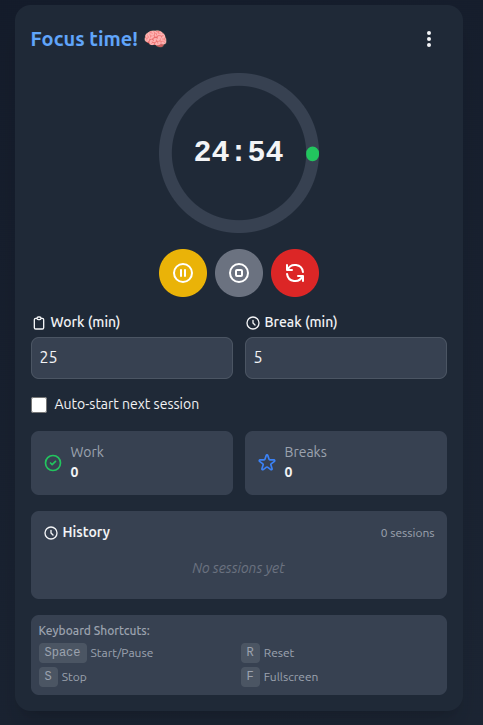

# 🌊 TaskTide

**TaskTide** is a minimalist productivity timer that helps you ride the tides of focused work and rejuvenating breaks. Inspired by the Pomodoro technique, TaskTide empowers you with custom work/break intervals, reminders, session tracking, and PWA support — all in a sleek mobile-friendly design.

---
## 🖼️ App Screenshot

> Landing page UI:



---

## 🚀 Features

- ⏱️ Customizable Work and Break Durations
- 🔁 Auto-switch between Focus and Break Modes
- 📊 Session Tracking (Work + Break Sessions)
- 📱 Fully Responsive and Mobile-Friendly
- 💾 PWA Support (Install as an App)
- 🔔 Optional Browser Notifications (Coming Soon)

---

## 🛠️ Tech Stack

- **React** (with Hooks)
- **Vite** (lightning-fast dev server)
- **Tailwind CSS** (utility-first styling)
- **Vite Plugin PWA** for installable app support

---

## 📦 Installation

```bash
git clone https://github.com/your-username/tasktide.git
cd tasktide
npm install
npm run dev
```

Visit: [http://localhost:5173](http://localhost:5173)

---

## 🧪 Build & Preview (PWA Mode)

```bash
npm run build
npm run preview
```

---

## 📁 Folder Structure

```
tasktide/
├── public/                 # PWA icons, manifest
├── src/
│   ├── Timer.jsx           # Main Timer component
│   ├── App.jsx             # App entry
│   ├── main.jsx            # Vite + React entry
│   └── index.css           # Tailwind styles
├── postcss.config.js
├── tailwind.config.js
├── vite.config.js
└── README.md
```

---

## 🔮 Upcoming Features

- 🧘‍♂️ Ambient sounds for focus/break
- 🔔 Desktop and Mobile Notifications
- 📅 Daily/Weekly Productivity History
- ☁️ Cloud Sync and Login (optional)

---

## 📄 License

MIT License  
Made with 💙 by [Reuben Nzembei]  
Inspired by the natural flow of deep work and restful breaks.

---

## 🌐 Live Demo

👉 [task-tide-t5a5.vercel.app](https://task-tide-t5a5.vercel.app/)